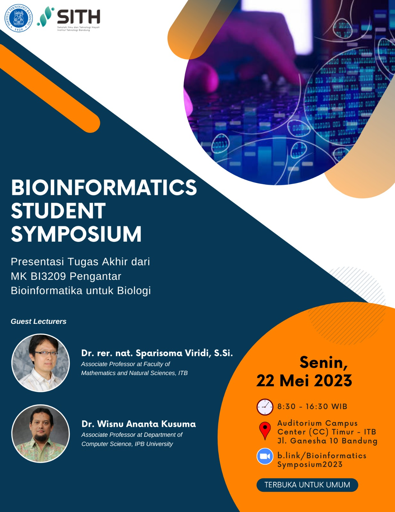

# 17

[BIOINFORMATICS STUDENT SYMPOSIUM]

SITH-ITB akan menyelenggarakan "Bioinformatics Student Symposium"
sebagai tugas akhir dari mahasiswa Mata Kuliah BI3209 Pengantar Bioinformatika untuk Biologi

Dengan Dosen Tamu: \
Dr. rer. nat. Sparisoma Viridi, S.Si. \
(Associate Professor at Faculty of Mathematics and Natural Sciences, ITB)

Dr. Wisnu Ananta Kusuma \
(Associate Professor at Department of Computer Science, IPB University)

📆: Senin, 22 Mei 2023 \
🕣: 8.30 - 16.30 WIB \
📍: Dilaksanakan secara HYBRID pada \
Auditorium Campus Center (CC) Timur - ITB, Jl. Ganesha 10, Bandung \
dan \
ZOOM: b.link/BioinformaticsSymposium2023

+ [info](info.md)
